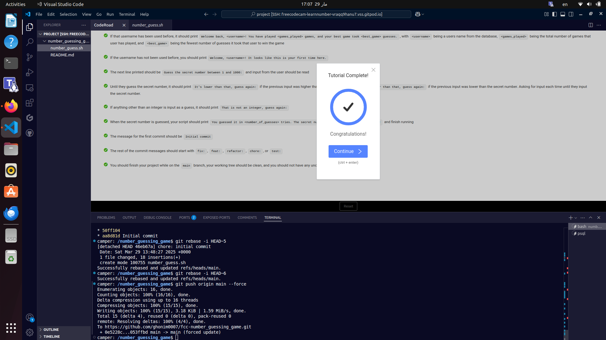

# **Number Guessing Game**  

This project is a **Bash script** that interacts with a **PostgreSQL database** to create a number guessing game. It allows users to play the game, tracks their number of attempts, and stores their best score for future reference.  

---

## **How to Use**  

1. **Create the database** and restore its structure by running:  
   ```sh
   psql --username=freecodecamp --dbname=postgres -f number_guess.sql
   ```  
2. **Make the script executable** (if not already):  
   ```sh
   chmod +x number_guess.sh
   ```  
3. **Run the game script**:  
   ```sh
   ./number_guess.sh
   ```  

---

## **Game Features**  

- Prompts the user to guess a randomly generated number.  
- Tracks the number of attempts for each game session.  
- Stores user information and best game score in a PostgreSQL database.  
- Displays previous game statistics when a returning user plays again.  

---

## **Completion Proof**  

Below are the images confirming the successful completion of this project:  

  
  

---

This project was completed as part of the **freeCodeCamp Relational Database Certification**. 🚀  
